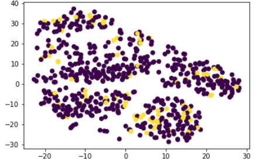

About: Using unsupervised machine learning to predict myopia or nearsightedness.

# Predicting Myopia

Author: Rosie Gianan, gianr00@gmail.com

Build With: Python, Pandas, scikit-learn, jupyter notebook 

## Objective:
Predict myopia or nearsightedness  using the unsupervised machine learning models. Using  the raw data saved in [myopia.csv](myopia.csv), create  the unsupervised machine learning models and several clustering algorithms to explore whether the patients can be placed into distinct groups.

## Myopia dataset
- AGE: Participant's age at first visit (years)
- SPHEQ: Spherical Equivalent Refraction (diopter)
- AL: Axial Length (mm)
- ACD: Anterior Chamber Depth (mm)
- LT: Lens Thickness (mm)
- VCD: Vitreous Chamber Depth (mm)
- SPORTHR: Time spent engaging in sports/outdoor activities (hours per week)
- READHR: Time spent reading for pleasure (hours per week)
- COMPHR: Time spent playing video/computer games or working on the computer (hours per week)
- STUDYHR: Time spent reading or studying for school assignments (hours per week)
- TVHR: Time spent watching television (hours per week)
- DIOPTERHR: Composite of near-work activities (hours per week)
- MOMMY: Was the subject’s mother myopic? (No (0) /Yes (1))
- DADMY: Was the subject’s father myopic? (No (0) /Yes (1))
- MYOPIC: Myopia within the first five years of follow up (No (0) /Yes (1))

# Solution:
1.    Prepare the data by removing the target column, null values and duplicate values. Standardize the dataset so that columns that contain larger values do not influence the outcome more than columns with smaller values. 
2.    Apply dimensionality reduction with PCA (Principal Component Analysis). Reduce the dataset dimensions with t-SNE on the principal components. Create a scatter plot of the t-SNE output.
3.    Perform a Cluster Analysis with K-means. Create an elbow plot to identify the best number of clusters.

### t-SNE plot: 

 
 
### Elbow plot: 

 
